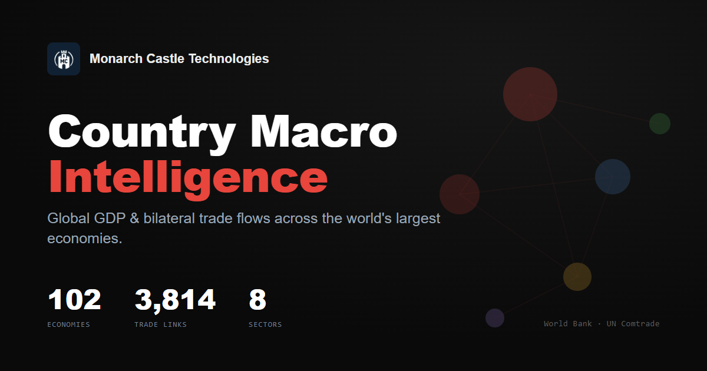

# Country Macro Intelligence

> by **Monarch Castle Technologies**

Interactive visualization of global GDP and bilateral trade flows across 102 of the
world's largest economies — with sector drilldowns, top-producer rankings, and trade-bloc
filters. Built with vanilla JavaScript and D3, deployed as a static site.

**Live:** https://akgularda.github.io/macrointel/



## Features

- **GDP bubble graph** — countries sized and colored by economic weight (GDP + trade intensity).
- **Bilateral trade flows** — directed links between trading partners, sourced from UN Comtrade.
- **Default lens** — a blended GDP + visible-trade heat score before any sector is chosen.
- **Sector drilldown** — top 10 producers across 8 sectors (Medicine, Electronics, Automotive,
  Energy, Agriculture, Textiles, Metals, Chemicals), for 2024 and 2023.
- **Country detail cards** — GDP, exports, imports, trade balance, top partners, sector exposure,
  bloc membership, and per-figure data provenance (observed vs. estimated).
- **Trade-bloc filters** — 18 blocs (EU, NATO, BRICS, ASEAN, G7, G20, CPTPP, RCEP, AfCFTA, …) with
  union / intersection member modes and touching / internal edge scope.
- **Search** with keyboard navigation, **camera focus** on selection, and **zoom-to-fit** framing.
- **Responsive** layout, keyboard-accessible nodes, reduced-motion support, and SEO / social metadata.

## Data

| Metric | Source |
|--------|--------|
| GDP (current USD) | World Bank — `NY.GDP.MKTP.CD` |
| National trade totals (exports / imports) | World Bank — `NE.EXP.GNFS.CD`, `NE.IMP.GNFS.CD` |
| Bilateral trade links | UN Comtrade — HS `TOTAL` goods exports (annual) |
| Sector exports | UN Comtrade — HS chapters, goods exports |

Bilateral links cover every economy that reports goods trade to UN Comtrade. A few
late- or non-reporters (e.g. Russia, Taiwan) appear with full GDP/trade totals but without
outbound bilateral links. Figures are nominal USD; trade values are goods-only (Comtrade)
while national totals include services (World Bank). Treat as indicative, not official statistics.

The site loads its dataset from `./data/country-macro-map.js` (`window.countryMacroData`).

## Controls

| Control | Description |
|---------|-------------|
| Year | Cycle available years (2024, 2023) |
| Direction | Export flows vs. mirrored inbound flows |
| Min Trade | Minimum bilateral trade threshold |
| Bloc | Multi-select blocs with member mode and edge scope |
| Sectors | Open the sector filter panel |
| About | Methodology and data sources |
| Reset | Reset all filters and selection |

### Keyboard shortcuts

- `/` — focus search
- `↑` / `↓` — move through search suggestions, `Enter` to select
- `Enter` / `Space` — open details for a focused country bubble
- `Esc` — close panel / dismiss dialog / reset view

## Running locally

No build step required — it's a static site.

```bash
npx http-server . -p 8080
# then open http://localhost:8080
```

Or open `index.html` directly in a browser.

## Refreshing the dataset

Bilateral links are regenerated from the UN Comtrade public API:

```bash
node tools/enrich-links.mjs .   # fetch fresh bilateral exports -> tools/new-links.json
node tools/splice-links.mjs .   # splice into data/country-macro-map.js + update metadata
```

## Architecture

- Vanilla JavaScript (single IIFE in `app.js`), no framework, no build.
- D3.js v7 for the force-directed graph.
- Static, deploy-ready; data is a precomputed `window.countryMacroData` blob.

## Deployment

Pushes to `main` deploy to GitHub Pages via `.github/workflows/pages.yml`. Ensure
**Settings → Pages → Build and deployment → Source** is set to **GitHub Actions**.

## License

[MIT](LICENSE) © 2026 Monarch Castle Technologies. Not affiliated with the World Bank or
the United Nations.
