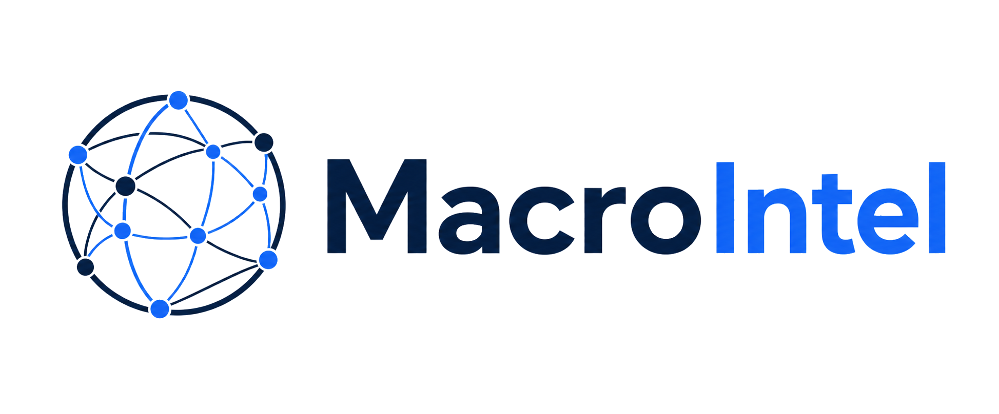

<div align="center">
  <picture><source media="(prefers-color-scheme: dark)" srcset="https://raw.githubusercontent.com/monarchcastletech/macrointel/main/docs/logo-dark.png"></picture>
  <!-- CODEX: generate a clean, modern product logo for "MacroIntel" — a dark, financial-intelligence wordmark/emblem evoking a globe of connected trade nodes (force-directed graph motif). Deep navy / slate background (#0a0a0a–#0b1f3a) with a single accent (electric blue #1f6feb). No stock-photo realism; crisp vector look, transparent PNG, ~512px square. -->

  # MacroIntel
  ### Macro-economic intelligence dashboard — global GDP & bilateral trade flows

  
  
  
  
</div>

> **Executive summary** — MacroIntel is an interactive macro-economic intelligence dashboard that maps the world's largest economies by output and by who they trade with. It renders GDP, bilateral trade flows, sector leadership, and trade-bloc structure for **102 economies** across **3,814 bilateral trade links**, drawing exclusively on authoritative public sources (World Bank and UN Comtrade). Built for analysts, strategists, and decision-makers who need to see the shape of the global economy at a glance — and trust every figure on screen.

## ✨ Highlights
- **GDP bubble graph** — every economy sized and colored by economic weight, blending GDP with trade intensity into a single readable lens.
- **Bilateral trade flows** — directed links between trading partners sourced from UN Comtrade, with adjustable minimum-trade thresholds and direction (export vs. mirrored inbound).
- **Sector drilldowns** — top-10 producer rankings across **8 sectors** (Medicine, Electronics, Automotive, Energy, Agriculture, Textiles, Metals, Chemicals) for 2024 and 2023.
- **Trade-bloc lenses** — **18 blocs** (EU, NATO, BRICS, ASEAN, G7, G20, CPTPP, RCEP, AfCFTA, and more) with union / intersection member modes and touching / internal edge scope.
- **Country detail cards** — GDP, exports, imports, trade balance, top partners, sector exposure, bloc membership, and **per-figure provenance** (observed vs. estimated).
- **Built for analysts** — keyboard-navigable search, camera focus on selection, zoom-to-fit framing, responsive layout, reduced-motion support, and full SEO / social metadata.
- **Zero-build static delivery** — vanilla JavaScript + D3 v7, deployed continuously to GitHub Pages.

## 🖼️ Preview
<!-- CODEX: drop product screenshots into docs/ — capture from the live site at https://monarchcastletech.github.io/macrointel/ -->
<!--  (screenshot pending) -->
<!-- CODEX: screenshot-1 — the main force-directed view: GDP bubbles sized by economic weight with bilateral trade links drawn between partners, dark theme, header stat bar visible. -->
<!--  (screenshot pending) -->
<!-- CODEX: screenshot-2 — a country selected, showing the detail card (GDP, exports, imports, trade balance, top partners, sector exposure, bloc membership) and/or the sector top-producer panel open. -->

## 🧭 What it does
MacroIntel turns two of the most authoritative open economic datasets into a single, explorable picture of the global economy.

**The macro graph.** Each node is an economy, sized and colored by a blended GDP + visible-trade heat score so the structure of global output reads at a glance before any filter is applied. Directed edges represent bilateral goods-export relationships, surfaced from UN Comtrade.

**Sector intelligence.** Switch into any of eight sectors to rank the top-10 producers for the selected year, exposing where pharmaceutical, electronics, automotive, energy, agricultural, textile, metals, and chemical capacity actually concentrates.

**Bloc analysis.** Apply any of 18 trade blocs as a lens — combine them with union or intersection member logic, and choose whether edges count as in-bloc when both endpoints are members (internal) or when at least one is (touching).

**Country deep-dives.** Selecting an economy opens a detail card with GDP, exports, imports, trade balance, leading trading partners, sector exposure, and bloc membership — with each figure flagged as observed or estimated.

**Navigation.** Type `/` to search, arrow through suggestions, `Enter` to focus a country, `Esc` to dismiss. Selecting a node flies the camera to it; the view re-frames to fit on reset.

## 🗂️ Data & provenance
Per Monarch Castle doctrine — **evidence before assertion**. Every figure in MacroIntel is traceable to a named public source, a snapshot date, and a collection method recorded in the dataset's `meta` block.

| Metric | Source | Series / method |
|--------|--------|-----------------|
| GDP (current USD) | **World Bank** API | `NY.GDP.MKTP.CD` |
| National trade totals (exports / imports) | **World Bank** API | `NE.EXP.GNFS.CD`, `NE.IMP.GNFS.CD` |
| Bilateral trade links | **UN Comtrade** | HS `TOTAL` goods exports, annual |
| Sector exports | **UN Comtrade** | HS chapters, goods exports |

- **Snapshot.** The shipped dataset (`data/country-macro-map.js`) was generated **2026-06-22**, covering **102 economies**, **3,814 bilateral links**, and years **2024 / 2023**. Generation timestamp and source registry are embedded in `window.countryMacroData.meta`.
- **Per-figure provenance.** Country values carry observed-vs-estimated flags (e.g. `exportsEstimated`, `importsEstimated`) so the dashboard can distinguish reported data from modeled fills.
- **Honest caveats.** Bilateral links cover economies that report goods trade to UN Comtrade; a few late or non-reporters (e.g. Russia, Taiwan) appear with full GDP/trade totals but without outbound bilateral links. Values are nominal USD; trade links are goods-only (Comtrade) while national totals include services (World Bank). **Treat as indicative analytical intelligence, not official statistics.**

## 🛠️ Tech stack
- **Language:** JavaScript (vanilla, single IIFE in `app.js`) — no framework, no build step.
- **Visualization:** [D3.js](https://d3js.org/) v7 (force-directed graph).
- **Markup & styling:** HTML5 + CSS3, dark theme; Bricolage Grotesque / Inter / JetBrains Mono typography.
- **Data layer:** precomputed `window.countryMacroData` blob in `data/country-macro-map.js`.
- **Refresh tooling:** Node ESM scripts (`tools/enrich-links.mjs`, `tools/splice-links.mjs`) against the UN Comtrade public API.
- **CI / deploy:** GitHub Actions (`.github/workflows/pages.yml`) → **GitHub Pages** (static hosting).

## 🚀 Getting started
**Live dashboard:** **https://monarchcastletech.github.io/macrointel/**

### Run locally
No build step required — it's a static site.

```bash
git clone https://github.com/monarchcastletech/macrointel.git
cd macrointel
npx http-server . -p 8080
# then open http://localhost:8080
```

Or simply open `index.html` directly in a browser.

### Refresh the dataset
Bilateral links are regenerated from the UN Comtrade public API:

```bash
node tools/enrich-links.mjs .   # fetch fresh bilateral exports -> tools/new-links.json
node tools/splice-links.mjs .   # splice into data/country-macro-map.js + update metadata
```

### Deploy
Pushes to `main` deploy automatically via GitHub Actions. Ensure **Settings → Pages → Build and deployment → Source** is set to **GitHub Actions**.

## 🧱 Part of Monarch Castle
> A product of **Financial Intelligence** · **Monarch Castle Technologies** — an operating company of **[Monarch Castle Holdings](https://github.com/MonarchCastleHoldings)**.
> Sister companies: [Monarch Castle Technologies](https://github.com/monarchcastletech) · [Strategic Data Company of Ankara](https://github.com/SDCofA)

## 📜 License
See `LICENSE` (MIT). © 2026 Monarch Castle Holdings · Ankara, Türkiye. Not affiliated with the World Bank or the United Nations.

<div align="center"><sub>🏰 Monarch Castle Holdings — turning open-source noise into lawful, verified, decision-grade intelligence.</sub></div>